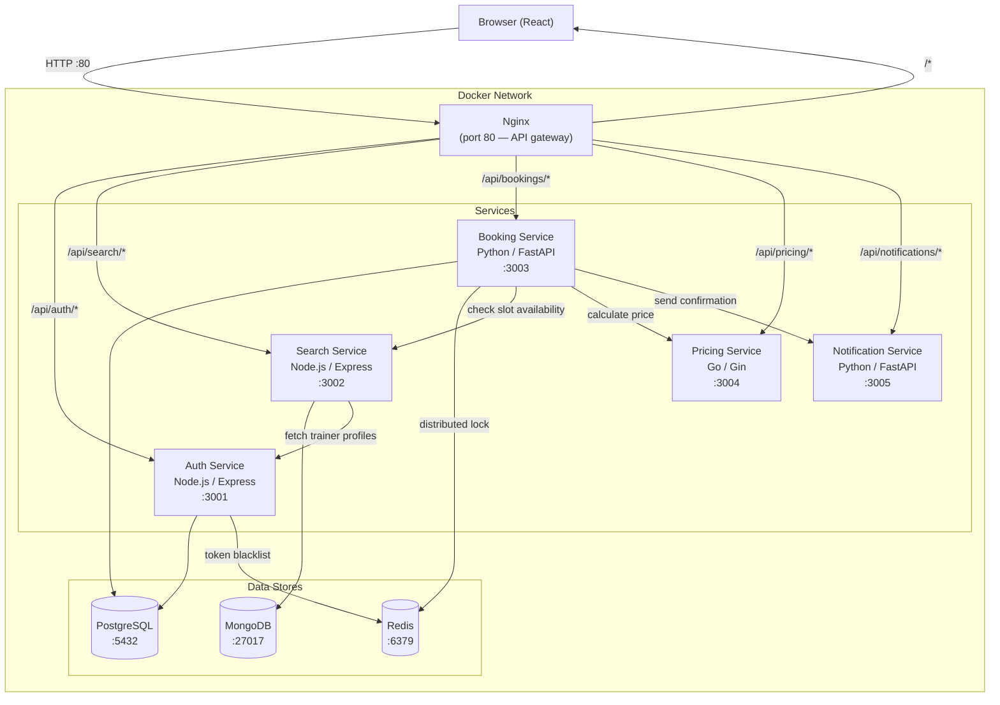

# BallBook

A basketball session booking platform built as a microservices system. Trainees can search for trainers, check availability, and book sessions. Trainers can manage their schedules and availability.

## Architecture



### How a booking flows through the system

1. The browser sends all requests to **Nginx** on port 80.
2. Nginx routes `/api/<service>/*` to the appropriate upstream service and strips the `/api/` prefix.
3. To create a booking, the **Booking Service**:
   - Verifies the user's JWT via the **Auth Service**
   - Acquires a **Redis distributed lock** on the slot to prevent double-bookings
   - Checks slot availability with the **Search Service**
   - Gets a dynamic price from the **Pricing Service**
   - Writes the booking to **PostgreSQL**
   - Triggers a confirmation via the **Notification Service**
   - Releases the Redis lock

## What Redis is used for

Redis serves two distinct purposes in this system:

### 1. JWT token blacklist (Auth Service)

JWTs are stateless — once issued they're valid until they expire. Without extra state, logging out doesn't actually invalidate a token; someone who captured it could keep using it.

When a user logs out, the auth service writes the token to Redis with a TTL equal to the token's remaining lifetime:

```js
await redisClient.setEx(`blacklist:${token}`, ttl, '1');
```

Every authenticated request checks Redis first:

```js
const isBlacklisted = await redisClient.get(`blacklist:${token}`);
if (isBlacklisted) return res.status(401).json({ error: 'Token has been revoked' });
```

The key expires automatically when the token would have expired anyway, so Redis doesn't accumulate stale data.

### 2. Distributed slot lock (Booking Service)

Without a lock, two users booking the same slot at the same moment could both pass the availability check and both get confirmed — a double-booking.

When a booking request arrives, the booking service atomically acquires a lock using Redis's `SET NX` (set if not exists):

```python
lock_acquired = redis_client.set(lock_key, "locked", nx=True, ex=30)
if not lock_acquired:
    raise HTTPException(409, "This slot is currently being booked. Please try again.")
```

`NX` makes the set atomic — only one request wins. `ex=30` means the lock auto-expires in 30 seconds even if the service crashes mid-booking. The lock is deleted once the booking is committed or rolled back.

## Services

| Service | Language | Port | Responsibilities |
|---|---|---|---|
| Auth | Node.js / Express | 3001 | Register, login, logout, JWT verification |
| Search | Node.js / Express | 3002 | Trainer search, availability slots (MongoDB) |
| Booking | Python / FastAPI | 3003 | Create/cancel bookings, distributed locking |
| Pricing | Go / Gin | 3004 | Dynamic price calculation |
| Notification | Python / FastAPI | 3005 | Booking confirmation notifications |

## Running locally

```bash
docker compose up --build
```

The app is then available at `http://localhost`.

## Tech stack

- **Frontend**: React, Axios
- **API gateway**: Nginx
- **Databases**: PostgreSQL (users, bookings), MongoDB (trainer profiles, availability), Redis (locks, token blacklist)
